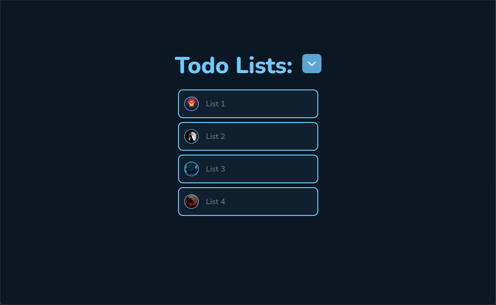
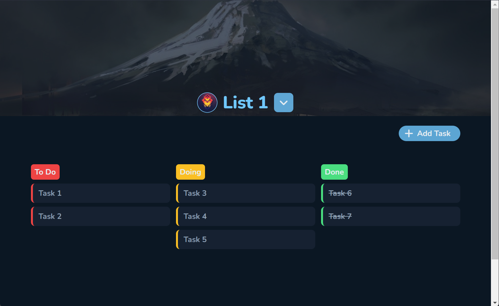
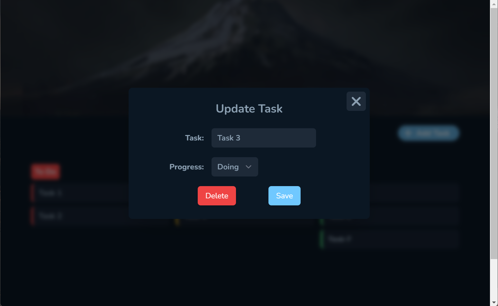
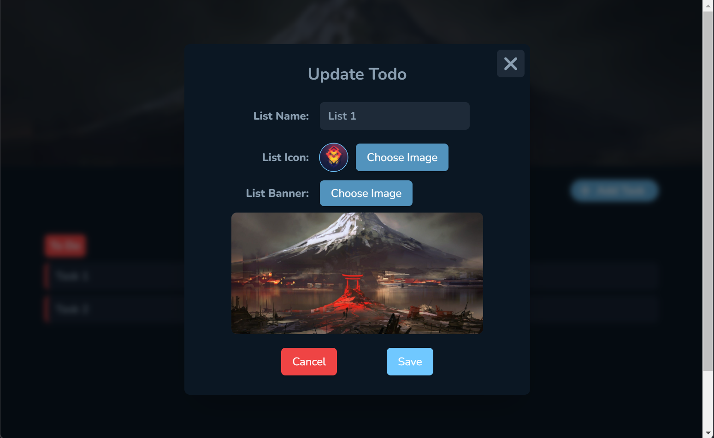

# Server-Side Development CA2: TODO List/App

### Overview
A simple todo list app that enables database crud operations.
 
A user can create, delete, and update a todo list and tasks within the todo list.

************************************

### Tools Used

- [Laravel 8](https://laravel.com/docs/8.x/installation#meet-laravel) as php framework.
- [Tailwindcss](https://tailwindcss.com/) for styling.
- [AlpineJs](https://alpinejs.dev/) for client side state management and interactivity.
- [MySQL](https://www.mysql.com/) for database

************************************

#### Screens

